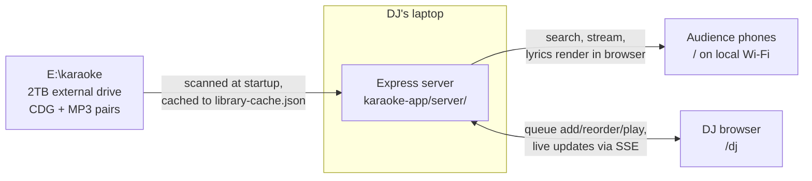

# Karaoke List

A self-hosted karaoke platform built for Shooter, a working karaoke DJ.
His laptop runs a small web server at gigs; audience phones on the same
Wi-Fi browse and preview a **~37,700-song library** (65,818 CDG+MP3 file
pairs collapsed by artist+title, ~330 GB, on an external drive; counts
as of the 2026-09-24 scan), and the DJ view adds a private queue. Plain Node/Express + vanilla HTML/CSS/JS — no framework, no build
step.

**Two views:** audience at `/` (search + preview), DJ at `/dj` (same plus
drag-to-reorder queue, live-synced across devices).

**Stack:** Node 24 + Express, vanilla HTML/CSS/JS, `cdgraphics` for in-browser
CDG lyric rendering, SSE for live queue sync, Cloudflare tunnel for off-network
demos. Tests run on `node --test`; `npm run check` is ESLint + knip.

**How it was built:** I'm the architect and quality bar, not the typist. Every
line was written by AI coding agents (Claude, Codex) working from specs,
tickets, and tests I directed. What I own is the structure: the decisions in
[`docs/adr/`](docs/adr/), the specs in [`docs/specs/`](docs/specs/), and the
test log that proves each change did what it was predicted to do. If you want
to see how a non-programmer ships real software, the ADRs are the place to
start.

---

## Run it

All of that lives in **[karaoke-app/README.md](karaoke-app/README.md)**:
quick start before a gig, firewall notes, adding songs, the Cloudflare
tunnel workflow for remote demos, and the API summary.

---

## How it connects



The full system diagram: **[karaoke-architecture.svg](karaoke-architecture.svg)**
(source: `karaoke-architecture.drawio` — edit there, then re-export):

```bash
draw.io --export --format svg --output karaoke-architecture.svg karaoke-architecture.drawio
```

---

## Repo layout

```
Karaoke Project/
├── karaoke-app/     # the application — has its own README (run, HOWTOs, API, code layout)
├── docs/
│   ├── adr/         # architecture decision records — the WHY behind structural choices
│   ├── agents/      # how agents work in this repo (standards, issue tracker, triage, domain)
│   ├── research/    # findings that feed the specs (disc-code lookup, freedb rescue)
│   └── specs/       # feature specs (metadata pipeline)
└── *.md, *.drawio   # project-level docs — mapped below
```

---

## Doc map

**Start here, in order** (for anyone picking this up cold):

1. **This README** — orientation: what it is, how it connects, where everything lives.
2. **[karaoke-architecture.svg](karaoke-architecture.svg)** — the system in one picture.
3. **[karaoke-app/README.md](karaoke-app/README.md)** — how to run it, HOWTOs, API, code layout. Documents the *system as it works today*.
4. **[karaoke_project_handoff.md](karaoke_project_handoff.md)** — current state, roadmap, and the why behind decisions. Documents the *project*. Start here to pick up development.

**Reference** (read when the question comes up):

- **[PRODUCT.md](PRODUCT.md)** — who it's for, what success looks like, brand personality. Answers "why does this feature exist?"
- **[DESIGN.md](DESIGN.md)** — the visual system (v4, "the scratched wall"). Tokens' source of truth is `karaoke-app/public/styles.css`; this explains them.
- **[karaoke_inventory.txt](karaoke_inventory.txt)** — raw library scan report (2026-05-15). Answers "what's actually on the drive?"
- **[docs/adr/](docs/adr/)** — one file per hard-to-reverse decision. Answers "why is it built this way?"
- **[docs/specs/](docs/specs/)** — feature specs for upcoming work (metadata pipeline).
- **[docs/research/](docs/research/)** — investigation results feeding those specs. Start with [llm-assisted-stage1-triage.md](docs/research/llm-assisted-stage1-triage.md): how the MusicBrainz verify + local-LLM judge pipeline turns parser proposals into ruled overrides (the `explore/mb-verify` arc, #27–#31).
- **[docs/agents/](docs/agents/)** — workflow config for AI agents working in this repo: coding standards, issue tracker, triage labels, domain glossary.

**Historical** (kept for context, not current):

- **[karaoke_claude_design_brief.md](karaoke_claude_design_brief.md)** — the original design-pass brief. Superseded by PRODUCT.md + DESIGN.md (the brand decision changed after it was written). Candidate for archiving.

**Rule of thumb:** the app README documents the *system*, the handoff
documents the *project*, ADRs document the *decisions*. A fact lives in
exactly one of them.

---

## Current state

Lives in **[karaoke_project_handoff.md](karaoke_project_handoff.md)** —
always check its `Last updated` line. `karaoke-app/TEST_LOG.md` records
what's been manually verified, session by session.

---

## License

[MIT](LICENSE). The song library itself is not part of this repo and is not
redistributed.
